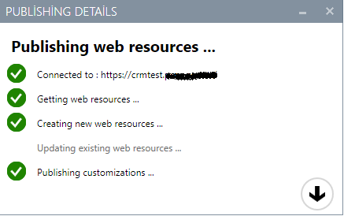
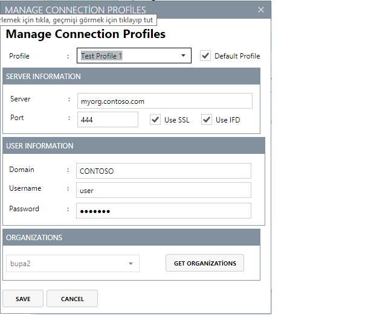
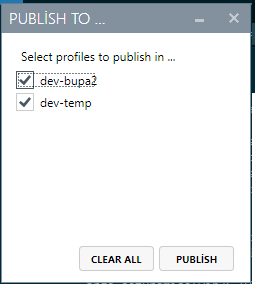

# PublishInCRM - Create, update and publish Webresources in CRM with Visual Studio

PublishInCRM is a Visual Studio Extension that allows developers to create, update and publish their web resources (such as js, html, css files) to one or more Microsoft Dynamics CRM environments directly within Visual Studio.

Please go to [the original repository for the full readme](https://github.com/cemyabansu/PublishInCrm).

### Changes from the original version 

- Added multiple environment feature
- Enhanced the connection settings screen to support multiple connection profiles
- Separated the output window from the main class to allow multiple publish threads to be created.
- Create/Delete publish profiles easily, no more XML involvement.

### Install

See [releases](https://github.com/seckin92/PublishInCrm/releases).

### To-do

- [x] Allow users to modify the connection info through the GUI.
- [x] Allow users to create and delete connection profiles
- [x] Publish to one or more environments simultaneously
- [x] Add support for multiple Visual Studio versions
- [ ] Add an option to review differences and last update date before overriding the remote web resource
- [ ] Code cleansing, refactoring & commentation 
- [ ] Stability tests

### Highlights

