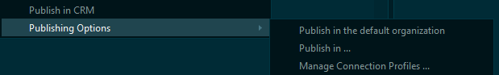
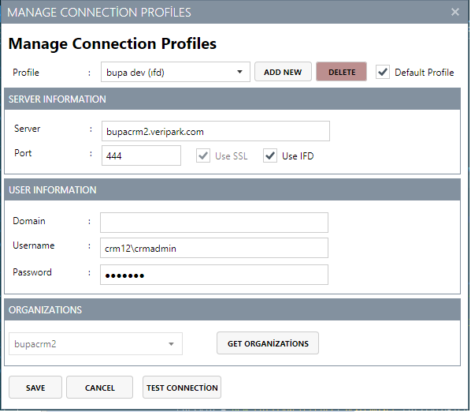

# PublishInCRM - Create, update and publish Webresources in CRM with Visual Studio

PublishInCRM is a Visual Studio Extension that allows developers to create, update and publish their web resources (such as js, html, css files) to one or more Microsoft Dynamics CRM environments directly within Visual Studio.

Please go to [the original repository for the full readme](https://github.com/cemyabansu/PublishInCrm).

### Changes from the original version 

- Added multiple environment feature
- Enhanced the connection settings screen to support multiple connection profiles
- Separated the output window from the main class to allow multiple publish threads to be created.

This version can be merged into a **new branch** instead of the master branch, to keep the stable version in tact and experiment/test the multiple environment feature.

### To-do

- Allow users to create and delete connection profiles
- Option to review differences and last update date before overriding the remote web resource
